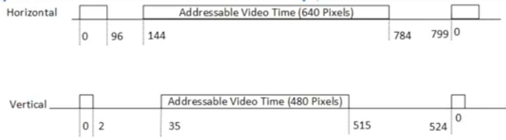

# Timing diagram

Total pixel:
- Horizontal: 800px
- Vertical: 525px

# Addressable video time

- Horizontal: 640px
- Vertical: 480px

Where the signals go high for the colors

# Pixel count start

- Horizontal: 96 pixels at the beginning that indicate *horizontal sync time* (signal for h_sync will go high during this time)
- Vertical: 2 pixels at the beginning that indicate *vertical sync time* (signal for v_sync will go high during this time)

# Sync signals
- h_sync: Indicates the beginning of each new line being displayed on the screen horizontally. It tells the monitor when to start drawing a new line across the screen
- v_sync: Indicates the beginning of each new frame being displayed on the screen vertically. It tells the monitor when to start drawing a new frame from the top of the screen

- The frequency of the h_sync signal determines the number of horizontal lines displayed per second
- The frequency of the v_sync signal determines the number of frames displayed per second 
